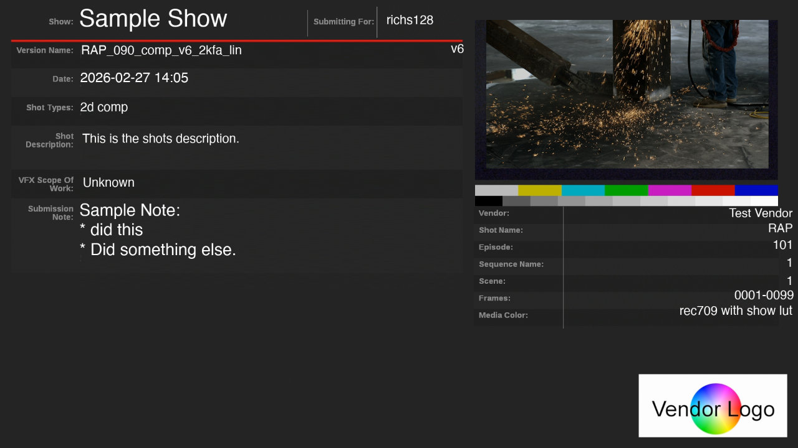
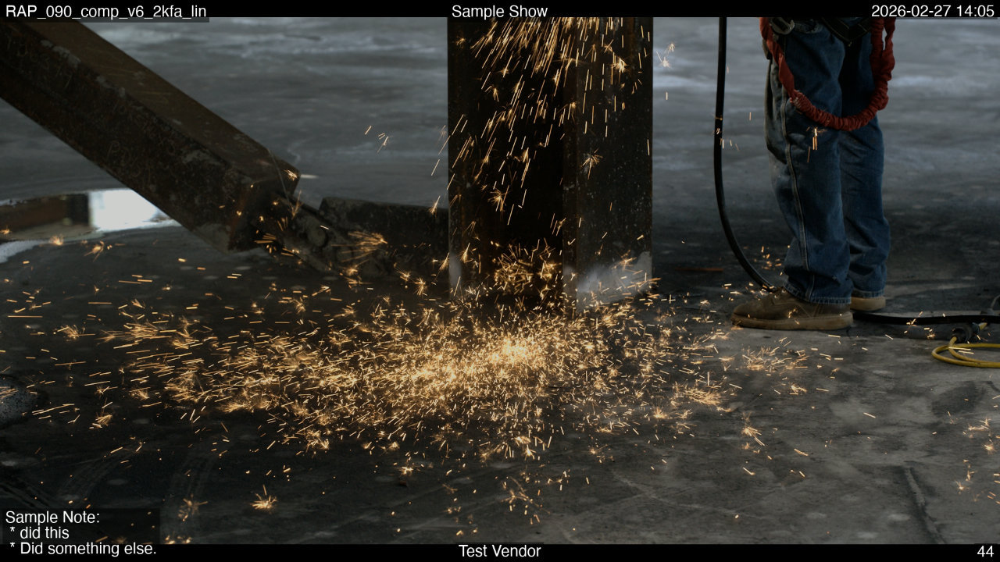
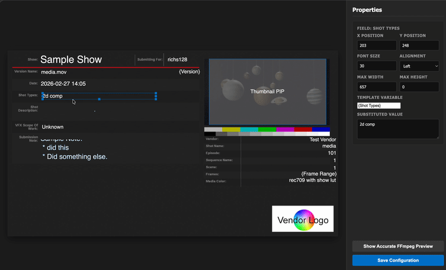

# ffmpeg-dailies

A Python toolkit for generating VFX dailies with slate overlays, burn-ins, and OCIO colour management — all driven by a single YAML configuration file and powered by FFmpeg.

| Example slate | Example burn-ins |
| :---: | :---: |
|  |  |

Slate Layout GUI to help position the slate fields:



## Features

- **Slate generation** — configurable title card with metadata fields and a PIP thumbnail from the middle of the clip
- **Burn-in overlays** — frame counter, filename, shot, show title, notes, and vendor text at configurable screen positions
- **GUI Layout Editor** — visual web-based editor to drag and drop slate fields and preview layouts in real-time
- **OCIO colour management** — uses FFmpeg's `ocio` filter with any ACES or studio config
- **YAML-driven layout** — all visual elements, codecs, and metadata are defined in a single config file
- **Python API** — call `ffmpeg_dailies.render()` directly from ShotGrid, Nuke, or any Python environment
- **Dry-run mode** — get the FFmpeg command as a list of strings for farm submission without executing it
- **Cross-platform font support** — per-OS font paths in config (`darwin`, `linux`, `win32`)

## Quick Start

### Prerequisites

- Python 3.10+
- FFmpeg with `libx264` and OCIO support, see: <https://github.com/sam-k-smith/ffmpeg-build-ocio>

### Setup

```bash
# Clone and set up the virtual environment
git clone <repo-url> && cd ffmpeg-dailies
python3 -m venv .venv
source .venv/bin/activate
pip install -r requirements.txt
```

### Visual Layout Editor (NEW)

Launch the web-based GUI to edit your `sample_config.yaml` and preview slate fields visually.

```bash
python -m ffmpeg_dailies.gui --config sample_config.yaml --input /path/to/media.mov
```

Open `http://localhost:8080` to drag fields, edit text templates, and save layout changes back to your YAML.

### Run via CLI

```bash
./run_dailies \
  --config sample_config.yaml \
  --input /path/to/sequence.%04d.exr \
  --output dailies_output.mov \
  --meta-shot RAP_090 \
  --meta-vendor "My Studio"
```

### Run via Python API

```python
import ffmpeg_dailies

cmd = ffmpeg_dailies.render(
    config_path="sample_config.yaml",
    input_media="/path/to/sequence.%04d.exr",
    output_media="dailies_output.mov",
    metadata={
        "Show Title": "My Show",
        "Shot": "RAP_090",
        "Notes": "WIP - internal review",
        "Vendor Name": "Studio X",
    },
    dry_run=False
)
```

## CLI Reference

```
usage: run_dailies [-h] --config CONFIG --input INPUT --output OUTPUT
                   [--framerate FRAMERATE] [--input-width INPUT_WIDTH]
                   [--input-height INPUT_HEIGHT] [--target-width TARGET_WIDTH]
                   [--target-height TARGET_HEIGHT] [--start-number START_NUMBER]
                   [--fit] [--dry-run]
                   [--meta-notes META_NOTES] [--meta-vendor META_VENDOR]
                   [--meta-shot META_SHOT] [--meta-filename META_FILENAME]
                   [--meta-show META_SHOW] [--meta-date META_DATE]
```

| Flag | Description |
| :--- | :--- |
| `--config`, `-c` | Path to YAML configuration file (required) |
| `--input`, `-i` | Input media path — QuickTime or image sequence using `%04d` or `@@@` notation (required) |
| `--output`, `-o` | Output file path (required) |
| `--framerate`, `-r` | Override input framerate (default: from config or `24`) |
| `--fit` | Preserve aspect ratio by padding instead of stretching |
| `--dry-run` | Print the FFmpeg command without executing it |
| `--meta-shot` | **NEW**: Set the `{Shot}` metadata token |
| `--meta-vendor` | Set the `{Vendor Name}` metadata token |
| `--meta-*` | Override other metadata fields (notes, filename, show, date) |

## Configuration

All layout, codecs, and metadata are configured in a single YAML file. See [`sample_config.yaml`](sample_config.yaml) for a complete example.

### `globals`

Top-level settings that control the output dimensions, framerate, codec selection, and font paths.

```yaml
globals:
  framerate: 24
  width: 1920
  height: 1080
  output_codec: h264_hq      # references a key in output_codecs
  font_size: 44               # default font size for slate/burn-in text
  ffmpeg_bin: null             # path to ffmpeg binary, or null to use $FFMPEG_BIN / $PATH
  font:                        # per-platform font path
    darwin: /System/Library/Fonts/Helvetica.ttc
    linux: /usr/share/fonts/truetype/dejavu/DejaVuSans.ttf
    win32: C:/Windows/Fonts/arial.ttf
```

### `output_codecs`

Named codec profiles. Reference them from `globals.output_codec`.

```yaml
output_codecs:
  h264_hq:
    codec: libx264
    crf: 18
    preset: slow
    pix_fmt: yuv420p10le
  prores_hq:
    codec: prores
    profile_args:
      profile: 3
      pix_fmt: yuv422p10le
```

### `metadata`

Default key-value pairs used to populate `{Token}` placeholders in slate fields and burn-in templates. These can be overridden at runtime via CLI flags (`--meta-*`) or the Python API's `metadata` dict.

```yaml
metadata:
  "Notes": "Sample Note"
  "Vendor Name": "Test Vendor"
  "Show Title": "Sample Show"
  "Date Delivered": "2026-02-26"
```

### `slate`

Configures the title card shown before the video content.

```yaml
slate:
  template_image: "base_slate.exr"  # optional background plate
  thumbnail_enabled: true            # PIP preview from middle frame
  fields:
    "Show":
      text: "{Show Title}"           # resolved from metadata
      x: 300
      y: 200
      font_size: 90
    "Date":
      text: "{Date Delivered}"
      x: 300
      y: 350
    "Notes": "{Notes}"               # simple string = auto-layout
```

### `burnins`

Configures persistent text overlays on every video frame.

```yaml
burnins:
  layout:
    lower_left: "{Notes}"
    lower_center: "{Vendor Name}"
    lower_right: "{frame}"           # special token: live frame counter
    top_left: "{File Name}"          # auto-resolved from input basename
    top_center: "{Show Title}"
    top_right: "{Date Delivered}"
  fonts:                              # optional per-position font overrides
    lower_left: "/path/to/font.ttc"
```

Available positions: `top_left`, `top_center`, `top_right`, `lower_left`, `lower_center`, `lower_right`.

### `ocio`

Colour management via OpenColorIO.

```yaml
ocio:
  enabled: true
  config_path: "/path/to/config.ocio"
  input_space: "ACEScg"
  output_space: "sRGB - Display"
  view: "ACES 1.0 - SDR Video"
```

## FFmpeg Binary Resolution

The FFmpeg binary is resolved in this order:

1. `globals.ffmpeg_bin` in the YAML config
2. `$FFMPEG_BIN` environment variable
3. `ffmpeg` on `$PATH`

## Python API

```python
ffmpeg_dailies.render(
    config_path: str,          # path to YAML config (required)
    input_media: str,          # input file or sequence pattern (required)
    output_media: str,         # output file path (required)
    metadata: dict = None,     # override metadata tokens
    framerate: str = None,     # override framerate
    start_number: int = None,  # override start frame
    input_width: int = None,   # override input width
    input_height: int = None,  # override input height
    target_width: int = None,  # override output width
    target_height: int = None, # override output height
    fit: bool = None,          # pad to preserve aspect ratio
    dry_run: bool = False,     # return command without executing
) -> list[str]                 # always returns the FFmpeg command list
```

The `metadata` dict keys map directly to `{Token}` placeholders in the config. If `"File Name"` is missing, it's automatically resolved from `input_media`'s basename.

## Testing

```bash
# Unit tests (no FFmpeg required)
PYTHONPATH=$PWD pytest tests/test_api.py

# Visual regression test (requires FFmpeg + test media)
FFMPEG_DAILIES_TEST_MEDIA="/path/to/SPARKS_ACES_%05d.exr" \
FFMPEG_BIN=/path/to/ffmpeg \
PYTHONPATH=$PWD pytest tests/test_api.py
```

The visual regression test renders a single PNG frame and compares it pixel-by-pixel against a checked-in golden reference image (`tests/golden_frame.png`).

## Project Structure

```
ffmpeg-dailies/
├── ffmpeg_dailies/
│   ├── __init__.py       # Python API: render() entry point
│   ├── __main__.py       # python -m ffmpeg_dailies support
│   ├── cli.py            # argparse CLI wrapper
│   ├── config.py         # YAML config parsing
│   ├── execute.py        # FFmpeg command building and execution
│   ├── filtergraph.py    # Complex filter construction (slate, burn-ins, OCIO)
│   ├── models.py         # Dataclasses for all config/context objects
│   └── utils.py          # Input sequence resolution (fileseq)
├── tests/
│   ├── test_api.py       # Unit + visual regression tests
│   ├── test_config.yaml  # Config used by visual test
│   └── golden_frame.png  # Reference image for visual regression
├── tools/
│   └── generate_slate_template.py  # Generates the base_slate.exr template
├── sample_config.yaml    # Example configuration
├── run_dailies           # Shell wrapper for CLI
└── requirements.txt      # Python dependencies
```

## License

MIT
